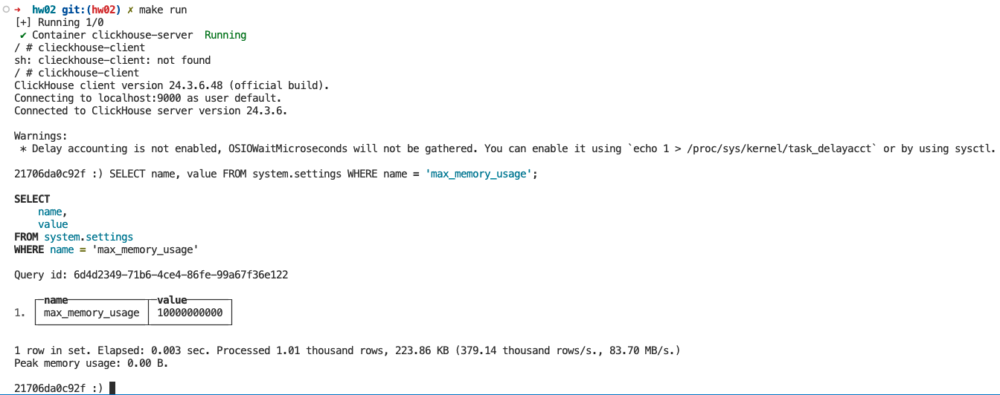
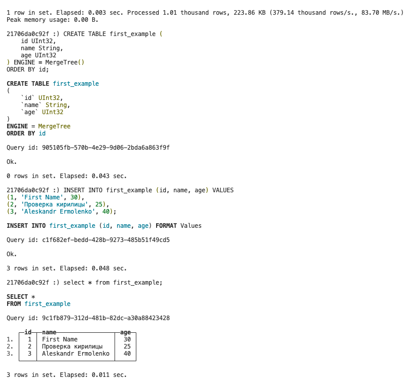
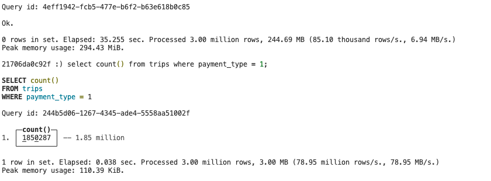
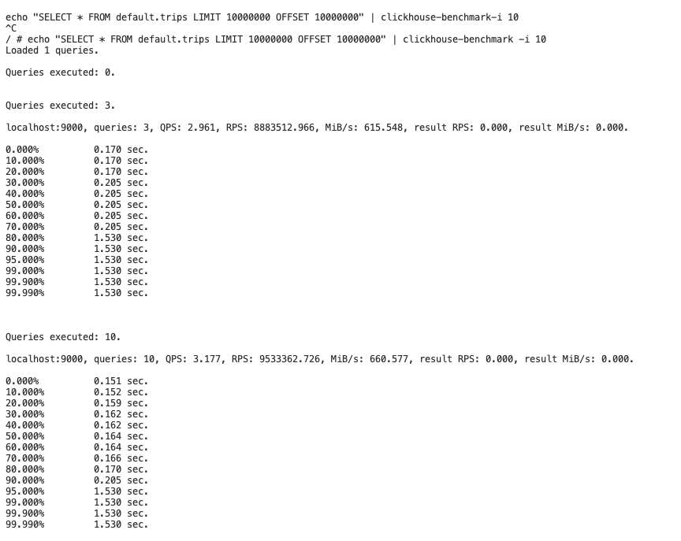
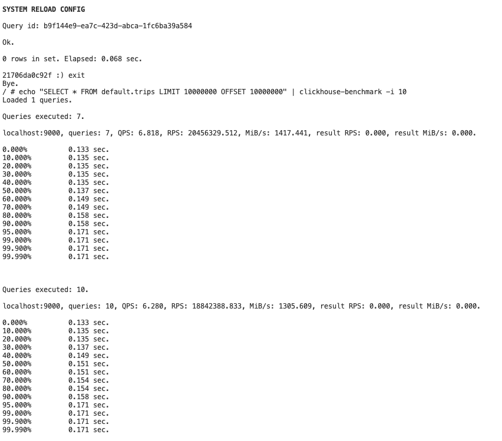

# Установить Clickhouse

В проекте Clickhouse в докере. Был написан docker-compose файл. Так же добавлены простенькие скрипты для дебага и запуска. В [README.md](./README.md) краткое описание скриптов.

Запускаем Clickhouse `make run`

Проверяем, что изменения из конфигурационного файла были применены `SELECT name, value FROM system.settings WHERE name = 'max_memory_usage'`
  

# Подгрузить датасет и сделать селект из таблицы

Создал простую таблицу и записал несколько записей

Подгрузил датасет спикера, запросил кол-во записей `select count() from trips where payment_type = 1;`

# Нагрузочное тестирование

Первое `echo "SELECT * FROM default.trips LIMIT 10000000 OFFSET 10000000" | clickhouse-benchmark -i 10` 

После некоторых манипуляций с конфигом 